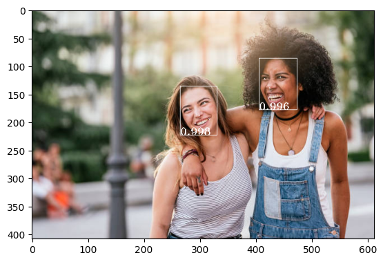

# FACER

Face related toolkit. This repo is still under construction to include more models.

## Updates
- [01/17/2025] FaRL Face Parsing is now available in [elliottzheng/batch-face](https://github.com/elliottzheng/batch-face?tab=readme-ov-file#face-parsing), which provides faster batch processing ability.
- [14/05/2023] Face attribute recognition model trained on CelebA is available, check it out [here](./samples/face_attribute.ipynb).
- [04/05/2023] Face alignment model trained on IBUG300W, AFLW19, WFLW dataset is available, check it out [here](./samples/face_alignment.ipynb).
- [27/04/2023] Face parsing model trained on CelebM dataset is available, check it out [here](./samples/face_parsing.ipynb).

## Install

The easiest way to install it is using pip:

```bash
pip install git+https://github.com/FacePerceiver/facer.git@main
```
No extra setup needs, pretrained weights will be downloaded automatically.

If you have trouble install from source, you can try install from PyPI:
```bash
pip install pyfacer
```
the PyPI version is not guaranteed to be the latest version, but we will try to keep it up to date.


## Face Detection

We simply wrap a retinaface detector for easy usage.
```python
import facer

image = facer.hwc2bchw(facer.read_hwc('data/twogirls.jpg')).to(device=device)  # image: 1 x 3 x h x w

face_detector = facer.face_detector('retinaface/mobilenet', device=device)
with torch.inference_mode():
    faces = face_detector(image)

facer.show_bchw(facer.draw_bchw(image, faces))
```


Check [this notebook](./samples/face_detect.ipynb) for full example.

Please consider citing
```
@inproceedings{deng2020retinaface,
  title={Retinaface: Single-shot multi-level face localisation in the wild},
  author={Deng, Jiankang and Guo, Jia and Ververas, Evangelos and Kotsia, Irene and Zafeiriou, Stefanos},
  booktitle={Proceedings of the IEEE/CVF Conference on Computer Vision and Pattern Recognition},
  pages={5203--5212},
  year={2020}
}
```

## Face Parsing

We wrap the [FaRL](https://github.com/faceperceiver/farl) models for face parsing.
```python
import torch
import facer

device = 'cuda' if torch.cuda.is_available() else 'cpu'

image = facer.hwc2bchw(facer.read_hwc('data/twogirls.jpg')).to(device=device)  # image: 1 x 3 x h x w

face_detector = facer.face_detector('retinaface/mobilenet', device=device)
with torch.inference_mode():
    faces = face_detector(image)

face_parser = facer.face_parser('farl/lapa/448', device=device) # optional "farl/celebm/448"

with torch.inference_mode():
    faces = face_parser(image, faces)

seg_logits = faces['seg']['logits']
seg_probs = seg_logits.softmax(dim=1)  # nfaces x nclasses x h x w
n_classes = seg_probs.size(1)
vis_seg_probs = seg_probs.argmax(dim=1).float()/n_classes*255
vis_img = vis_seg_probs.sum(0, keepdim=True)
facer.show_bhw(vis_img)
facer.show_bchw(facer.draw_bchw(image, faces))
```


Check [this notebook](./samples/face_parsing.ipynb) for full example.

Please consider citing
```
@inproceedings{zheng2022farl,
  title={General facial representation learning in a visual-linguistic manner},
  author={Zheng, Yinglin and Yang, Hao and Zhang, Ting and Bao, Jianmin and Chen, Dongdong and Huang, Yangyu and Yuan, Lu and Chen, Dong and Zeng, Ming and Wen, Fang},
  booktitle={Proceedings of the IEEE/CVF Conference on Computer Vision and Pattern Recognition},
  pages={18697--18709},
  year={2022}
}
``` 


## Face Alignment

We wrap the [FaRL](https://github.com/faceperceiver/farl) models for face alignment.
```python
import torch
import cv2
from matplotlib import pyplot as plt

device = 'cuda' if torch.cuda.is_available() else 'cpu'

import facer
img_file = 'data/twogirls.jpg'
# image: 1 x 3 x h x w
image = facer.hwc2bchw(facer.read_hwc(img_file)).to(device=device)  

face_detector = facer.face_detector('retinaface/mobilenet', device=device)
with torch.inference_mode():
    faces = face_detector(image)

face_aligner = facer.face_aligner('farl/ibug300w/448', device=device) # optional: "farl/wflw/448", "farl/aflw19/448"

with torch.inference_mode():
    faces = face_aligner(image, faces)

img = cv2.imread(img_file)[..., ::-1]
vis_img = img.copy()
for pts in faces['alignment']:
    vis_img = facer.draw_landmarks(vis_img, None, pts.cpu().numpy())
plt.imshow(vis_img)
```


Check [this notebook](./samples/face_alignment.ipynb) for full example.

Please consider citing
```
@inproceedings{zheng2022farl,
  title={General facial representation learning in a visual-linguistic manner},
  author={Zheng, Yinglin and Yang, Hao and Zhang, Ting and Bao, Jianmin and Chen, Dongdong and Huang, Yangyu and Yuan, Lu and Chen, Dong and Zeng, Ming and Wen, Fang},
  booktitle={Proceedings of the IEEE/CVF Conference on Computer Vision and Pattern Recognition},
  pages={18697--18709},
  year={2022}
}
``` 

## Face Attribute Recognition
We wrap the [FaRL](https://github.com/faceperceiver/farl) models for face attribute recognition, the model achieves 92.06% accuracy on [CelebA](https://mmlab.ie.cuhk.edu.hk/projects/CelebA.html) dataset.

```python
import sys
import torch
import facer

device = "cuda" if torch.cuda.is_available() else "cpu"

# image: 1 x 3 x h x w
image = facer.hwc2bchw(facer.read_hwc("data/girl.jpg")).to(device=device)

face_detector = facer.face_detector("retinaface/mobilenet", device=device)
with torch.inference_mode():
    faces = face_detector(image)

face_attr = facer.face_attr("farl/celeba/224", device=device)
with torch.inference_mode():
    faces = face_attr(image, faces)

labels = face_attr.labels
face1_attrs = faces["attrs"][0] # get the first face's attributes

print(labels)

for prob, label in zip(face1_attrs, labels):
    if prob > 0.5:
        print(label, prob.item())
```

Check [this notebook](./samples/face_attribute.ipynb) for full example.

Please consider citing
```
@inproceedings{zheng2022farl,
  title={General facial representation learning in a visual-linguistic manner},
  author={Zheng, Yinglin and Yang, Hao and Zhang, Ting and Bao, Jianmin and Chen, Dongdong and Huang, Yangyu and Yuan, Lu and Chen, Dong and Zeng, Ming and Wen, Fang},
  booktitle={Proceedings of the IEEE/CVF Conference on Computer Vision and Pattern Recognition},
  pages={18697--18709},
  year={2022}
}
``` 
